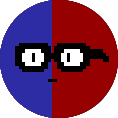

#  changecharge 

Change Charge is a puzzle game about charges made by @Gamedev-do-Hiroshi organization. The goal is to take Charge-Chan (the main character) from the power cable to the power plug avoiding many obstacles in the way.

# Developers
A game made by:
- Luciano Leão (@LeaoLuciano)
- Marcos Siolin (@siolinm)
- Davi Menezes (@davimp)
- Willian Hiroshi (@willhiroshi)
- Lucas Harada (@Lucas3H)
- Rafael Carvalho (@rafarillo)
- Lucas Irineu (@lirineu)
# Objects

## Charge-Chan
The main character

## Power Plug
Place where Charge-Chan wants to go

## Power Cable
Where Charge-Chan starts each level

## Lamp
Collectable item. Charge-Chan needs to hit its basis in order to collect it.

## Battery
Gives a determined amount of charge to Charge-chan accordingly its color (blue is negative and red is positive)

## Charge (either positive or negative)
Attracts or repulse Charge-Chan based on his.

## Magnetic Field
Applies a magnetic force into what stays in its area

## Cyclops
Kills Charge-Chan if his amount of charge has is the opposite of the cylops' amount of charge (Charge-Chan is positive and the cylops is negative, for example). If Charge-Chan is neutral it doesn't do anything.

## Black Hole
Has 40% chance of teleporting Charge-Chan into a random place in the screen and a 60% chance of killing him.

## Electric Fence
An electric fence that kills Charge-Chan on collision

## Others obstacles

- Resistors
- Small battery
- Pencil
- Chalks

# Camera views

Tap G to focus camera on Charge-Chan

Tap F to move the camera dragging the background
# Screenshots

# How to run this game:

## Windows

Run the .exe file that's inside Exports/change_charge_windows_xx where xx is your system architecture.

## Linux

Run the binary file that's inside Exports/change_charge_linux_xx where xx is your system architecture.

# Tools Used

- Godot Engine: https://godotengine.org/
- Pixil Art: https://www.pixilart.com/
- GIMP: https://www.gimp.org/
- SoundTrap: https://www.soundtrap.com/